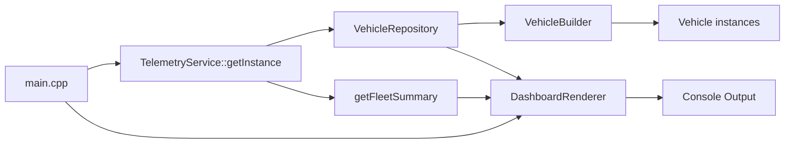
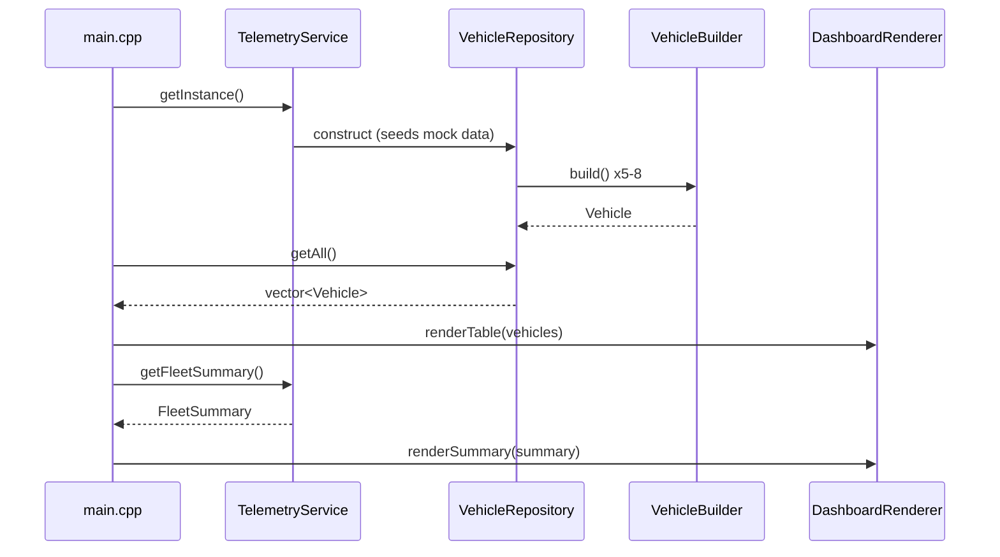

# Software Design Document (SWDD)
## Vehicle Telemetry Visualization

**Version:** 1.0
**Date:** 2026-09-28
**Status:** Draft

---

## 1. Introduction

### 1.1 Purpose
This document describes the software design for the Vehicle Telemetry Visualization prototype — a C++17 console application that ingests mock vehicle telemetry and renders it as a formatted ASCII dashboard for fleet operators. It serves as a GitHub Copilot training artifact demonstrating the Builder, Repository, and Singleton design patterns.

### 1.2 Scope
Covers architecture, module decomposition, data structures, class interfaces, control flow, and build configuration for a single-pass, dependency-free console executable. Excludes GUI, persistence, networking, and real-time simulation (per [docs/requirements.md](requirements.md)).

### 1.3 References
- [docs/requirements.md](requirements.md) — functional requirements & verification criteria
- [.github/copilot-instructions.md](../.github/copilot-instructions.md) — coding standards, tech stack, folder structure

---

## 2. System Overview

The system is a single-executable, layered C++ console application with no external I/O. Execution is a single pass:



---

## 3. Design Goals & Constraints

| Constraint | Detail |
|---|---|
| Language | C++17 only |
| Build | CMake, single executable target |
| Dependencies | None — standard library only |
| Warnings | Must compile clean with `-Wall -Wextra` |
| Execution model | Single-pass render, no loop, no file/DB/network I/O |
| Testing | None in initial scope |
| Naming | PascalCase classes, camelCase methods/variables |
| File layout | One class per header/source pair |

---

## 4. Architecture

### 4.1 Layering

```
main.cpp (entry point / orchestration)
    │
    ▼
TelemetryService (Singleton — aggregation logic)
    │
    ▼
VehicleRepository (Repository — in-memory storage)
    │
    ▼
VehicleBuilder (Builder — object construction)
    │
    ▼
Vehicle (data struct)

DashboardRenderer (presentation layer — consumes repository + service output)
```

### 4.2 Design Patterns

| Pattern | Class | Responsibility |
|---|---|---|
| Builder | `VehicleBuilder` | Fluent, step-by-step construction of `Vehicle` objects, avoiding large constructors |
| Repository | `VehicleRepository` | Encapsulates in-memory `std::vector<Vehicle>` storage; hides data access details behind `getAll()` / `getById()` |
| Singleton | `TelemetryService` | Guarantees one fleet-wide service instance; computes cross-cutting aggregations |

---

## 5. Module / Class Design

### 5.1 `Vehicle.h`
Plain data struct — no behavior.

```cpp
struct Vehicle {
    int id;
    std::string name;
    double speed;             // km/h
    int battery;              // percent 0-100
    double latitude;
    double longitude;
    std::string lastUpdated;  // timestamp, formatted string
};
```

### 5.2 `VehicleBuilder.h/.cpp`
```cpp
class VehicleBuilder {
public:
    VehicleBuilder& withId(int id);
    VehicleBuilder& withName(const std::string& name);
    VehicleBuilder& withSpeed(double speed);
    VehicleBuilder& withBattery(int battery);
    VehicleBuilder& withGps(double lat, double lon);
    VehicleBuilder& withTimestamp(const std::string& ts);
    Vehicle build() const;

private:
    Vehicle vehicle_{};
};
```
- Each `with*` method sets a field on the internal `Vehicle` and returns `*this` by reference to enable chaining.
- `build()` returns a copy of the fully constructed `Vehicle`.

### 5.3 `VehicleRepository.h/.cpp`
```cpp
class VehicleRepository {
public:
    VehicleRepository();  // seeds 5-8 mock vehicles via VehicleBuilder
    const std::vector<Vehicle>& getAll() const;
    std::optional<Vehicle> getById(int id) const;

private:
    std::vector<Vehicle> vehicles_;
};
```
- Constructor populates `vehicles_` using `VehicleBuilder` calls — this is the single source of mock data.
- `getById` returns `std::optional<Vehicle>` to represent "not found" without exceptions or sentinel values.

### 5.4 `TelemetryService.h/.cpp`
```cpp
struct FleetSummary {
    int totalVehicles;
    double averageSpeed;
    std::vector<Vehicle> lowBatteryVehicles;
};

class TelemetryService {
public:
    static TelemetryService& getInstance();
    const VehicleRepository& getRepository() const;
    FleetSummary getFleetSummary(int lowBatteryThreshold = 20) const;

    TelemetryService(const TelemetryService&) = delete;
    TelemetryService& operator=(const TelemetryService&) = delete;

private:
    TelemetryService() = default;
    VehicleRepository repository_;
};
```
- Meyers' singleton (function-local static) guarantees thread-safe lazy initialization and a single instance for `getInstance()`.
- Copy constructor/assignment deleted to enforce singleton contract.
- `getFleetSummary` computes count, average speed, and filters vehicles below the battery threshold.

### 5.5 `DashboardRenderer.h/.cpp`
```cpp
class DashboardRenderer {
public:
    static void renderTable(const std::vector<Vehicle>& vehicles);
    static void renderSummary(const FleetSummary& summary);
};
```
- Stateless utility class (static methods) — pure presentation, no side effects beyond stdout.
- `renderTable` prints a fixed-width aligned ASCII table using `std::setw`/`std::left`/`std::right` from `<iomanip>`.
- `renderSummary` prints total count, average speed, and a low-battery warning list below the table.

### 5.6 `main.cpp`
```cpp
int main() {
    auto& service = TelemetryService::getInstance();
    DashboardRenderer::renderTable(service.getRepository().getAll());
    DashboardRenderer::renderSummary(service.getFleetSummary());
    return 0;
}
```

---

## 6. Data Flow



---

## 7. Error Handling
- No exceptions expected in normal flow (all data is hardcoded, no I/O).
- `getById` uses `std::optional` instead of throwing, per "no file I/O" and simplicity goals.
- Fleet must always be non-empty (5–8 hardcoded vehicles), so average-speed division-by-zero is not a runtime concern, but `getFleetSummary` should still guard `averageSpeed = totalVehicles > 0 ? sum/totalVehicles : 0.0` for robustness.

---

## 8. Build Configuration

`CMakeLists.txt`:
```cmake
cmake_minimum_required(VERSION 3.10)
project(vehicle_telemetry)
set(CMAKE_CXX_STANDARD 17)
set(CMAKE_CXX_STANDARD_REQUIRED ON)
add_compile_options(-Wall -Wextra)
add_executable(vehicle_telemetry
    src/main.cpp
    src/VehicleBuilder.cpp
    src/VehicleRepository.cpp
    src/TelemetryService.cpp
    src/DashboardRenderer.cpp
)
```

---

## 9. Traceability to Requirements

| Requirement (FR#) | Design Element |
|---|---|
| FR1 — 5-8 mock vehicles with full field set | `Vehicle` struct + `VehicleRepository` seed data |
| FR2 — fleet aggregates | `TelemetryService::getFleetSummary` |
| FR3 — ASCII table | `DashboardRenderer::renderTable` |
| FR4 — fleet summary section | `DashboardRenderer::renderSummary` |
| FR5 — single executable, no dependencies | `CMakeLists.txt` |

---

## 10. Verification Mapping

| Verification Criteria | Design Support |
|---|---|
| Clean `-Wall -Wextra` compile | `add_compile_options(-Wall -Wextra)` in CMake |
| Aligned ASCII table | `<iomanip>` fixed-width formatting in `DashboardRenderer` |
| Average speed / low-battery count correctness | Pure computation in `TelemetryService::getFleetSummary`, verifiable against hardcoded data |
| Singleton returns same instance | Meyers' singleton (`static` local in `getInstance()`) |
| README documents architecture | Separate deliverable, cross-references this SWDD |

---

## 11. Out of Scope (per requirements)
GUI/web frontend, real map rendering, file/DB/network I/O, real-time looping (stretch only), third-party libraries, unit tests.

---

## 12. Resolved Design Decisions

These behaviors were unspecified in earlier revisions and were raised as open questions by the unit-test design review. They are now decided so the corresponding test cases have a definitive expected result. The decisions are recorded in `docs/ut-design/review-decisions.json` and applied to the test design by `apply_review.py`.

| Decision | Choice | Rationale |
|---|---|---|
| Builder validation | Store values verbatim | SWDD 5.2 defines the builder as a plain field setter; validation is out of scope for the prototype. `withSpeed(-10.0)` stores `-10.0`. |
| Low-battery comparison | Strict less-than (`battery < threshold`) | Matches FR2's "below the threshold" wording. A vehicle exactly at the threshold is not flagged. |
| Renderer numeric precision | Fixed 2 decimals | Keeps the table columns stable and the output deterministic. |
| Long name handling | Widen the Name column | Preserves data; truncation would silently lose information in a teaching artifact. |
| Empty fleet rendering | Header row only | Simplest behavior consistent with "render a table"; no special-case message. |
| No low-battery vehicles | Omit the warning section | Avoids a misleading empty list. |
| Zero-vehicle summary | Print total 0 and average 0.00 | Consistent with the SWDD 7 division guard. |
| NaN average | Print the literal `nan` | Surfaces the bad value rather than masking it as 0.00. |
| Seed id range | 1..N | Makes `getById(0)` and `getById(9999)` unambiguously "not found". |
| Repository test seam | None | The production constructor always seeds; cases that need an empty or custom fleet are deferred rather than adding an injection seam the SWDD does not define. |
